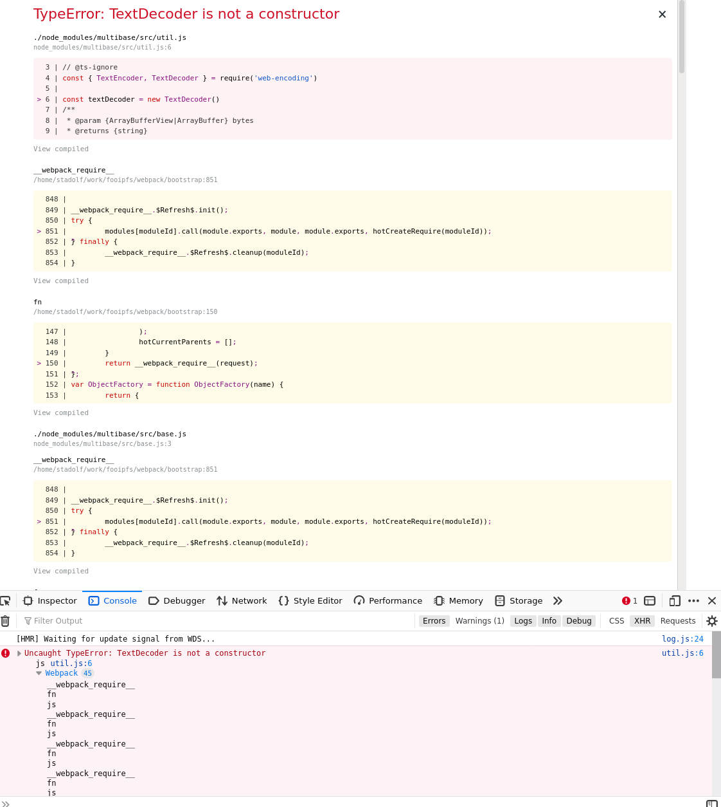

```
yarn
yarn start
```


demoes the error message `TypeError: TextDecoder is not a constructor` when using IPFS 0.54 with CRA.

arises from missing polyfills or sth at `https://github.com/Gozala/web-encoding/issues/1#issuecomment-676811667`. Relates to https://github.com/Gozala/web-encoding/issues/1

also reported here:
https://discuss.ipfs.io/t/receiving-textencoder-is-not-a-constructor-on-an-extremely-basic-ipfs-node-js-program-please-help/9875/2

